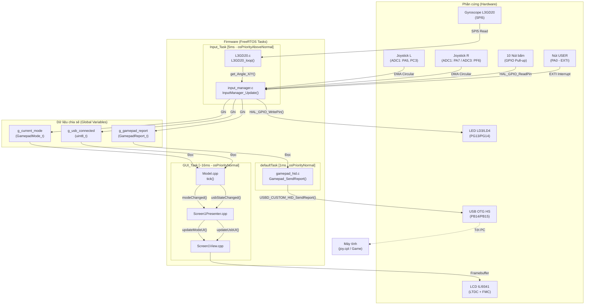
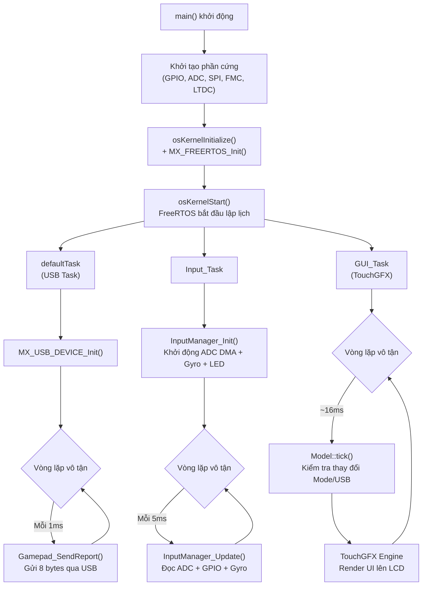
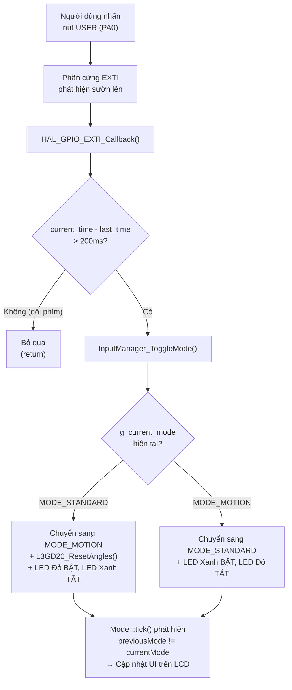

# BÁO CÁO PROJECT CUỐI KỲ: STM32 DUAL-MODE GAMEPAD CONTROLLER

**Lớp:** 166152 - IT4210  
**Giảng viên hướng dẫn:** TS. Đỗ Công Thuần  

**Sinh viên thực hiện:**
1. Vũ Tiến Lợi - 20235768
2. Trần Duy Hưng - 20235744
3. Nguyễn Hải Đăng - 20235672

---

## 1. Giới thiệu đề tài

### 1.1 Mô tả về sản phẩm / mục tiêu của project
Sản phẩm của dự án là một thiết bị **Mô phỏng tay cầm PS5** được phát triển trên nền tảng vi điều khiển STM32 (board STM32F429I-DISCO). Mục tiêu cốt lõi của project là **mô phỏng một HID Gamepad** tiêu chuẩn (không mô phỏng đầy đủ các tính năng phức tạp của DualSense chính hãng mà tập trung vào các chức năng điều khiển cốt lõi). 

Thiết bị cho phép người dùng thao tác qua các Joystick vật lý hoặc bẻ lái bằng cảm biến chuyển động (Motion Control), truyền tín hiệu trực tiếp về máy tính qua cáp USB và được hệ điều hành nhận diện ngay lập tức như một Game Controller chuẩn mực (Plug and Play). Ngoài ra, dự án còn tích hợp thêm màn hình đồ họa TouchGFX để nâng cao tính trực quan và trải nghiệm người dùng (UX).

### 1.2 Các yêu cầu đối với project

#### a. Yêu cầu chức năng (Functional Requirements)
Bám sát theo đề bài của học phần, thiết bị đáp ứng đầy đủ và chính xác các yêu cầu đầu vào/đầu ra sau:
* **Hệ thống nút và trục điều khiển:** Hỗ trợ **2 trục analog** (đọc từ 2 module Joystick KY-023) và hệ thống nút bấm vượt chỉ tiêu đề bài với **10 nút vật lý** (≥ 6 nút theo yêu cầu), bao gồm các nút Action, Trigger và nút L3/R3 trên cần gạt.
* **Giao tiếp máy tính:** **Gửi HID report về máy tính qua USB**. Gói dữ liệu (Report) chứa toàn bộ trạng thái nút bấm và trục tọa độ, đảm bảo **máy tính nhận thiết bị như một game controller** chuẩn mà không cần cài thêm driver của bên thứ ba.
* **Xử lý tín hiệu Joystick:** **Có dead zone và hiệu chuẩn joystick**. Thuật toán bằng phần mềm ép tọa độ về chính giữa (128) khi cần gạt ở trạng thái nghỉ, loại bỏ hoàn toàn hiện tượng trôi (drift) nhân vật trong game do sai số linh kiện cơ khí.
* **Cảm biến chuyển động:** **Đọc gyroscope (L3GD20) và ánh xạ sang ít nhất hai trường dữ liệu HID**. Góc nghiêng trục X và Y của board mạch được tính toán thông qua tích phân vận tốc góc, sau đó ánh xạ (mapping) trực tiếp thay thế cho giá trị trục X và Y của Joystick phải.
* **Chuyển đổi chế độ (Mode Switch):** **Có chế độ chuyển đổi giữa joystick và motion control**. Người dùng bấm nút USER vật lý trên mạch để luân phiên giữa Mode 1 (chỉ dùng Joystick) và Mode 2 (kích hoạt Gyroscope để bẻ lái/nhắm bắn).
* **Hiển thị trạng thái:** **LED hiển thị trạng thái kết nối hoặc chế độ**. Sử dụng 2 LED on-board (Xanh/Đỏ) kết hợp với giao diện UI trên màn hình LCD (TouchGFX) để báo cáo trực quan thiết bị đang ở Mode nào và trạng thái kết nối USB đã Ready hay chưa.

#### b. Yêu cầu phi chức năng (Non-functional Requirements)
* **Độ trễ (Latency):** Tốc độ lấy mẫu (polling rate) của USB HID đạt 1000Hz (1ms), đảm bảo độ trễ siêu thấp cho trải nghiệm gaming eSports.
* **Độ cứng vững:** Thuật toán lọc rò rỉ (Leak factor) áp dụng lên Gyroscope giúp góc quay luôn ổn định, tự động trả về tâm mượt mà, không bị cộng dồn sai số theo thời gian.
* **Độ ổn định hệ thống:** Ứng dụng FreeRTOS để quản lý đa luồng (chia Task riêng biệt cho Input, USB và Màn hình), đảm bảo tay cầm không bị giật lag ngay cả khi màn hình đang render đồ họa nặng.

---

## 2. Thiết kế

### 2.1 Phân chia chức năng: Phần cứng vs Phần mềm

Bảng dưới đây phân tích rõ từng chức năng của hệ thống được thực hiện bởi phần cứng (tự động, không cần CPU can thiệp) hay phần mềm (do firmware lập trình xử lý):

| Chức năng | Phần cứng (HW) tự xử lý | Phần mềm (SW) xử lý |
|---|---|---|
| **Đọc Joystick (Analog)** | Khối **ADC + DMA** tự động chuyển đổi tín hiệu điện áp từ chân PA5, PA7, PC3, PF6 thành giá trị số 12-bit liên tục (Circular mode), không cần CPU can thiệp. | Hàm `Process_ADC_Axis()` trong `input_manager.c` đọc giá trị từ buffer DMA, áp dụng **Dead zone** (khoảng 1848–2248) và thu nhỏ 12-bit → 8-bit bằng phép dịch bit `>> 4`. |
| **Đọc nút bấm (Digital)** | Khối **GPIO** với điện trở **Pull-up nội** (Internal Pull-up) kéo chân lên mức cao. Khi nhấn nút, mạch vật lý kéo chân xuống mức thấp (Active Low). | Hàm `InputManager_Update()` gọi `HAL_GPIO_ReadPin()` đọc trạng thái 10 chân GPIO (8 nút + 2 SW joystick) và đóng gói thành bitmap 16-bit (`g_gamepad_report.buttons`). |
| **Chuyển Mode (USER Button)** | Khối **EXTI** (External Interrupt) trên chân PA0 phát hiện **sườn lên** (Rising Edge) và tạo ngắt cứng (`EXTI0_IRQn`, priority = 6). | Hàm callback `HAL_GPIO_EXTI_Callback()` bắt ngắt và gọi `InputManager_ToggleMode()` để chuyển đổi Mode + đổi trạng thái LED. |
| **Đo góc nghiêng (Gyroscope)** | Cảm biến **L3GD20** trên board giao tiếp qua bus **SPI5** (MOSI: PF9, MISO: PF8, SCK: PF7, CS: PC1), trả về dữ liệu vận tốc góc thô (raw angular rate) 16-bit. | Thư viện `L3GD20.c` thực hiện: hiệu chuẩn offset (thu 2000 mẫu), tích phân hình thang (trapezoidal) tính góc, lọc nhiễu bằng Noise Threshold, và thuật toán **Leak Factor** (`Angle *= 0.999f`) chống drift. |
| **Gửi dữ liệu USB** | Khối **USB_OTG_HS** (PB14/PB15, Internal FS PHY) tự xử lý giao thức USB ở tầng vật lý (điện áp, timing) và tầng liên kết (handshake, token, ACK/NAK). | Firmware đóng gói **HID Report** 8 bytes (`GamepadReport_t`: 2B buttons + 4B axes + 2B gyro_raw) và gọi `USBD_CUSTOM_HID_SendReport()` để đẩy vào USB endpoint mỗi 1ms. |
| **Hiển thị LCD** | Khối **LTDC** (LCD-TFT Display Controller) + **DMA2D** (tăng tốc đồ họa 2D phần cứng) + **FMC** (giao tiếp SDRAM chứa framebuffer). Ba khối này phối hợp truyền pixel ra màn hình ILI9341 mà không chiếm băng thông CPU. | Framework **TouchGFX** vẽ giao diện đồ họa (icon Mode, text trạng thái USB, đổi màu chữ). Logic cập nhật UI nằm trong `Model.cpp` → `Screen1Presenter.cpp` → `Screen1View.cpp`. |
| **LED chỉ thị Mode** | 2 LED on-board: **LD3** (PG13, Xanh) và **LD4** (PG14, Đỏ) là GPIO Output Push-Pull thuần túy. | Hàm `InputManager_ToggleMode()` gọi `HAL_GPIO_WritePin()` để bật LED Xanh / tắt LED Đỏ (Mode 1) hoặc ngược lại (Mode 2). |
| **Lập lịch đa luồng** | Bộ đếm phần cứng **TIM6** tạo xung heartbeat (SysTick) đều đặn mỗi 1ms cho kernel FreeRTOS. | **FreeRTOS** dùng xung tick này để lập lịch chuyển ngữ cảnh giữa 3 Task: `Input_Task` (5ms), `defaultTask/USB` (1ms), `TouchGFXTask` (~16ms). |

---

### 2.2 Thiết kế phần cứng

#### a. Danh sách Module & Linh kiện
* **Vi điều khiển trung tâm (MCU):** Lõi ARM Cortex-M4 trên vi điều khiển STM32F429ZIT6 (thuộc kit phát triển STM32F429I-DISCO). Đóng vai trò bộ não xử lý toàn bộ logic hệ thống.
* **Cảm biến Analog (2 trục/cần):** 2 x Module Joystick KY-023. Mỗi module cung cấp 2 trục analog (trục X, trục Y) thông qua chiết áp và 1 nút nhấn (Tactile switch) dưới trục.
* **Nút bấm rời (Digital):** 8 x Nút nhấn Tactile switch (4 chân) đóng vai trò làm cụm phím Action (A, B, X, Y) và cụm phím Trigger (L1, R1, L2, R2).
* **Cảm biến chuyển động (Motion Sensor):** IC Gyroscope L3GD20 (được tích hợp sẵn trên board). Dùng để đo vận tốc góc theo 3 trục X, Y, Z.
* **Màn hình hiển thị:** TFT LCD ILI9341 kích thước 2.4 inch (tích hợp sẵn trên board). Dùng làm màn hình GUI hiển thị trạng thái tay cầm.
* **Cổng giao tiếp máy tính:** Cổng USB Micro-B (CN6 - USB USER) tích hợp trên board để kết nối với máy tính.

#### b. Sơ đồ mạch & Ghép nối linh kiện
Để đảm bảo sự ổn định của tín hiệu Analog, toàn bộ nguồn VCC của Joystick được cấp bằng mức điện áp **3.3V** của board thay vì 5V. Hệ thống nút bấm sử dụng kỹ thuật kéo trở lên nguồn (Internal Pull-up) từ bên trong vi điều khiển, do đó các nút nhấn vật lý chỉ cần nối trực tiếp xuống Ground (GND).

**Bảng sơ đồ nối dây Joystick (KY-023):**

| Module Pin | Board Pin | Chức năng (Peripheral) |
|---|---|---|
| **Joystick L - GND** | GND | Cấp mass (Ground) |
| **Joystick L - +5V(VCC)** | 3V3 | Cấp nguồn 3.3V (Tránh dùng 5V) |
| **Joystick L - VRX** | PA5 | Kênh Analog: ADC1_CH5 |
| **Joystick L - VRY** | PC3 | Kênh Analog: ADC1_CH13 |
| **Joystick L - SW (L3)** | PB2 | Nút nhấn: GPIO Input (Pull-up) |
| **Joystick R - GND** | GND | Cấp mass (Ground) |
| **Joystick R - +5V(VCC)** | 3V3 | Cấp nguồn 3.3V (Tránh dùng 5V) |
| **Joystick R - VRX** | PA7 | Kênh Analog: ADC1_CH7 |
| **Joystick R - VRY** | PF6 | Kênh Analog: ADC3_CH4 |
| **Joystick R - SW (R3)** | PB4 | Nút nhấn: GPIO Input (Pull-up) |

**Bảng sơ đồ nối dây 8 nút bấm chức năng (Tactile):**
*(Tất cả 8 nút đều có 1 chân nối vào Board Pin, chân còn lại nối chung xuống GND)*

| Tên nút trên Gamepad | Board Pin | Trạng thái nhấn (Active State) |
|---|---|---|
| **BTN_CROSS (A)** | PC8 | LOW (Do dùng Pull-up) |
| **BTN_CIRCLE (B)** | PA9 | LOW |
| **BTN_SQUARE (X)** | PA10 | LOW |
| **BTN_TRIANGLE (Y)** | PB3 | LOW |
| **BTN_L1** | PB7 | LOW |
| **BTN_R1** | PD2 | LOW |
| **BTN_L2** | PG2 | LOW |
| **BTN_R2** | PG3 | LOW |

**Các thành phần tích hợp sẵn trên Board (Không cần nối dây):**
* **USB OTG:** Cổng CN6 đã nối sẵn vào đường dữ liệu PB14 (USB_DM) và PB15 (USB_DP).
* **Nút chuyển Mode:** Nút USER màu xanh trên board (chân PA0).
* **LED chỉ thị Mode:** LD3 màu xanh (chân PG13) và LD4 màu đỏ (chân PG14).
* **Gyroscope L3GD20:** Giao tiếp nội bộ qua bus SPI5.
* **Màn hình LCD:** Giao tiếp nội bộ qua bus FMC và SPI5.

#### c. Địa chỉ giao tiếp và Tốc độ trao đổi dữ liệu (Bus Speed)

| Thành phần ngoại vi | Chuẩn giao tiếp / Bus | Tốc độ / Tần số | Ghi chú |
|---|---|---|---|
| **USB Gamepad** | USB OTG FS (Full Speed) | 12 Mbps (Polling rate: **1000Hz**) | Endpoint gửi gói Report Descriptor kích thước 8 bytes (58 bytes cấu trúc) về máy tính mỗi 1ms (BINTERVAL = 1). |
| **ADC (Joystick)** | DMA2 Stream 0 & Stream 1 | Lấy mẫu **144 Cycles** | DMA (Direct Memory Access) tự động lặp liên tục để lấy giá trị điện áp cần gạt mà không gây nghẽn luồng xử lý chính. Cập nhật vào Input Task mỗi 5ms (200Hz). |
| **Gyroscope (L3GD20)**| SPI5 (MOSI: PF9, SCK: PF7) | **~5.6 MHz** (Baudrate) | CPU đọc thanh ghi của cảm biến L3GD20 thông qua giao thức SPI ở tốc độ cao, chu kỳ đọc 10ms (100Hz). |
| **LCD Framebuffer** | FMC & DMA2D | **~90 MHz** (SDRAM Clock) | Băng thông cao giúp đẩy dữ liệu pixel liên tục ra màn hình ILI9341, đảm bảo tốc độ khung hình (FPS) mượt mà cho TouchGFX. |
| **Hệ điều hành** | SysTick Timer (TIM6) | **1000 Hz** (1ms tick) | Bộ đếm thời gian thực cung cấp xung nhịp cơ sở để FreeRTOS lập lịch cho toàn bộ hệ thống. |

---

### 2.3 Thiết kế phần mềm

#### a. Các module phần mềm tương ứng từng tính năng

| Module (File) | Tính năng | Mô tả chức năng |
|---|---|---|
| **`input_manager.c/.h`** | Đọc Joystick + Nút bấm + Chuyển Mode | Quản lý toàn bộ đầu vào vật lý. Đọc 4 kênh ADC (Joystick), đọc 10 chân GPIO (nút bấm), áp dụng Dead zone, đóng gói dữ liệu vào struct `GamepadReport_t`, chuyển đổi Mode 1 ↔ Mode 2 và điều khiển LED. |
| **`gamepad_hid.c/.h`** | Gửi dữ liệu USB | Đóng vai trò tầng truyền dữ liệu. Kiểm tra trạng thái kết nối USB (`USBD_STATE_CONFIGURED`), sau đó gọi `USBD_CUSTOM_HID_SendReport()` để đẩy gói HID Report 8 bytes vào endpoint USB. |
| **`usbd_custom_hid_if.c`** | Khai báo USB Descriptor | Chứa mảng `CUSTOM_HID_ReportDesc_HS[]` (58 bytes) — bản "CMND" khai báo với máy tính rằng thiết bị là Gamepad có 16 nút, 4 trục analog 8-bit, và 1 trục gyro 16-bit. |
| **`L3GD20.c/.h`** | Đo góc nghiêng (Gyroscope) | Thư viện điều khiển cảm biến L3GD20 qua SPI5. Bao gồm: hiệu chuẩn offset tự động (2000 mẫu), tích phân hình thang tính góc tuyệt đối, lọc nhiễu bằng Noise Threshold, và thuật toán Leak Factor (`Angle *= 0.999f`) chống drift. |
| **`Model.cpp` / `Screen1Presenter.cpp` / `Screen1View.cpp`** | Hiển thị giao diện UI (TouchGFX) | Tuân theo mô hình kiến trúc **MVP** (Model–View–Presenter). `Model` đọc biến toàn cục từ firmware C (`g_current_mode`, `g_usb_connected`), phát hiện thay đổi rồi thông báo qua `Presenter`, `Presenter` chuyển tiếp cho `View` cập nhật giao diện (đổi text Mode, đổi icon gamepad/gyro, đổi màu chữ USB xanh/đỏ). |
| **`freertos.c`** | Lập lịch đa luồng (FreeRTOS) | Khởi tạo và quản lý 3 Task song song: `defaultTask` (gửi USB mỗi 1ms), `Input_Task` (đọc cảm biến mỗi 5ms), `GUI_Task` (render màn hình TouchGFX ~16ms). |

#### b. Sơ đồ khối hệ thống (System Block Diagram)

Sơ đồ dưới đây mô tả cách các module phần mềm kết nối với nhau và tương tác với phần cứng:

#### c. Biểu đồ luồng hoạt động của hệ thống (Flowchart)

**Luồng 1: Vòng đời chính của FreeRTOS (3 Task song song)**

**Luồng 2: Xử lý chuyển đổi Mode (EXTI Interrupt)**

---

## 3. Cài đặt / Xây dựng hệ thống

### 3.1 Hướng dẫn cài đặt & Công cụ phát triển

**Link GitHub:** `[Điền link GitHub repo của nhóm]`

Để clone và build lại project, cần cài đặt các công cụ sau:

| Công cụ | Phiên bản sử dụng | Mục đích |
|---|---|---|
| **STM32CubeMX** | 6.x (tương thích .ioc File.Version=6) | Cấu hình ngoại vi (ADC, GPIO, USB, FreeRTOS), sinh mã khởi tạo. |
| **STM32CubeIDE** | 1.x (Toolchain STM32CubeIDE) | Biên dịch firmware C/C++, nạp code (Flash) và debug trực tiếp trên board qua ST-Link. |
| **TouchGFX Designer** | 4.26.1 (X-CUBE-TOUCHGFX) | Thiết kế giao diện đồ họa (Widget, Font, Image), sinh mã C++ theo kiến trúc MVP. |
| **STM32 HAL Driver** | STM32F4 HAL (FW Package) | Thư viện lập trình trừu tượng hóa phần cứng (Hardware Abstraction Layer) cho dòng STM32F4xx. |
| **FreeRTOS** | CMSIS_V2 (tích hợp trong CubeMX) | Hệ điều hành thời gian thực, quản lý đa luồng (Task scheduling). |
| **USB Device Library** | STM32 USB Device (Custom HID) | Thư viện giao tiếp USB HID class, tương thích Plug-and-Play trên Windows/Linux/macOS. |

**Hướng dẫn cài đặt nhanh (README):**
1. Clone repository: `git clone <link_repo>`
2. Mở file `remote/STM32F429I_DISCO_REV_D01.ioc` bằng STM32CubeMX để xem cấu hình.
3. Import thư mục `remote/STM32CubeIDE/` vào STM32CubeIDE (File → Import → Existing Projects).
4. Nối dây phần cứng (Joystick, nút bấm) theo sơ đồ ở Mục 2.2.
5. Cắm cáp USB Micro-B vào cổng **CN6 (USB User)** trên board.
6. Build project (Ctrl+B), sau đó Flash code (Run → Debug).
7. Mở `joy.cpl` trên Windows hoặc truy cập [hardwaretester.com/gamepad](https://hardwaretester.com/gamepad) để kiểm tra.

### 3.2 Mô tả các module phần mềm chính

| Module | File chính | Dòng code | Chức năng cốt lõi |
|---|---|---|---|
| **Input Manager** | `Core/Src/input_manager.c` | 131 dòng | Đọc 4 kênh ADC (Joystick), đọc 10 chân GPIO (nút bấm), áp dụng Dead zone (khoảng ADC 1848–2248 → ép về 128), đóng gói bitmap 16-bit, chuyển đổi Mode, điều khiển LED. |
| **USB HID Gamepad** | `Core/Src/gamepad_hid.c` | 14 dòng | Kiểm tra trạng thái kết nối USB (`USBD_STATE_CONFIGURED`), gọi `USBD_CUSTOM_HID_SendReport()` gửi gói 8 bytes. |
| **USB Descriptor** | `USB_DEVICE/App/usbd_custom_hid_if.c` | 58 bytes descriptor | Khai báo HID Report Descriptor: 16 nút (2 bytes), 4 trục analog 8-bit (4 bytes), 1 trục gyro 16-bit (2 bytes). |
| **Gyroscope L3GD20** | `Core/Src/L3GD20.c` | 371 dòng | Giao tiếp SPI5 với cảm biến L3GD20. Hiệu chuẩn offset (2000 mẫu), tích phân trapezoidal, lọc Noise Threshold, Leak Factor (`0.999f`) chống drift. |
| **TouchGFX UI** | `TouchGFX/gui/src/model/Model.cpp`, `screen1_screen/Screen1Presenter.cpp`, `screen1_screen/Screen1View.cpp` | 131 dòng (tổng 3 file) | Kiến trúc MVP: Model đọc `g_current_mode` và `g_usb_connected`, phát hiện thay đổi → Presenter chuyển tiếp → View cập nhật text Mode, icon (gamepad/gyro), màu chữ USB (xanh/đỏ). |
| **FreeRTOS Tasks** | `Core/Src/freertos.c` | 188 dòng | Khởi tạo 3 Task: `defaultTask` (USB, 1ms, osPriorityNormal), `Input_Task` (5ms, osPriorityAboveNormal), `GUI_Task` (TouchGFX, 8192×4 stack, osPriorityNormal). |
| **EXTI Callback** | `Core/Src/main.c` (dòng 563–578) | 16 dòng | Xử lý ngắt nút USER (PA0). Chống dội phím (Debounce 200ms) bằng `HAL_GetTick()`, gọi `InputManager_ToggleMode()`. |

### 3.3 Đóng góp của từng thành viên

| Thành viên | Nhiệm vụ | Đánh giá |
|---|---|---|
| **Vũ Tiến Lợi** | • Thiết kế giao diện TouchGFX Designer (layout, widget, icon, font)   • Thiết kế sơ đồ ghép nối phần cứng (nối dây Joystick, nút bấm)   • Cấu hình CubeMX toàn bộ (USB, ADC, GPIO, EXTI, FreeRTOS, Generate Code)   • Sửa thư viện L3GD20 (fix 3 bug, thêm hàm ResetAngles)   • Viết USB HID Report Descriptor + module `gamepad_hid.c/.h`   • Viết báo cáo cuối kỳ | 33.33% |
| **Trần Duy Hưng** | • Tích hợp Gyro vào Mode 2 trong `input_manager.c` (ánh xạ `get_Angle_X/Y` → joystick phải)   • Viết EXTI callback nút USER + hàm `ToggleMode()` + điều khiển LED   • Ánh xạ phi tuyến (Quadratic mapping) + Leak Factor chống drift | 33.33% |
| **Nguyễn Hải Đăng** | • Viết module `input_manager.c/.h` — Đọc Joystick và Nút bấm (Dead zone, đọc ADC, đọc nút bấm, bitmap)   • Cập nhật FreeRTOS tasks trong `freertos.c` (USB 1ms, Input 5ms)   • Test joystick và nút bấm trên `joy.cpl` | 33.33% |

> **Ghi chú:** Số commit của từng thành viên được thể hiện trên trang GitHub repository của nhóm.

### 3.4 Kết quả

* **Link video demo:** `[Điền link video demo]`
* **Link ảnh chụp demo:** `[Điền link ảnh demo]`

### 3.5 Đánh giá

#### a. Các yêu cầu đề bài đã đạt được

| Yêu cầu đề bài | Trạng thái | Ghi chú |
|---|---|---|
| Mô phỏng HID Gamepad (không đầy đủ DualSense) | ✅ Đạt | Thiết bị được Windows nhận diện như Game Controller chuẩn, Plug-and-Play. |
| 2 trục analog | ✅ Đạt | 2 module Joystick KY-023, đọc qua ADC1 + ADC3 với DMA Circular. |
| ≥ 6 nút | ✅ Vượt | 10 nút vật lý (8 nút chức năng + 2 nút L3/R3 trên cần gạt). |
| Gửi HID report về PC qua USB | ✅ Đạt | Gói 8 bytes gửi mỗi 1ms (1000Hz) qua USB OTG HS. |
| Máy tính nhận thiết bị như game controller | ✅ Đạt | Custom HID Report Descriptor 58 bytes, hiện trong `joy.cpl` không cần driver. |
| Dead zone và hiệu chuẩn joystick | ✅ Đạt | Dead zone phần mềm (ADC 1848–2248 → ép về 128), scale 12-bit → 8-bit. |
| LED hiển thị trạng thái kết nối hoặc chế độ | ✅ Đạt | LD3 (Xanh) = Mode 1, LD4 (Đỏ) = Mode 2. Kết hợp UI trên LCD hiển thị USB READY/DISCONNECTED. |
| Đọc gyroscope và ánh xạ sang ≥ 2 trường HID | ✅ Đạt | L3GD20 đọc góc X, Y → ánh xạ thay thế Right Joystick X và Y (2 trường HID). |
| Chế độ chuyển đổi giữa joystick và motion control | ✅ Đạt | Nút USER chuyển Mode 1 (Joystick thuần) ↔ Mode 2 (Gyro Motion). Debounce 200ms. |

#### b. Ưu điểm
* **Tốc độ phản hồi cực nhanh:** Polling rate 1000Hz (1ms) — ngang tầm tay cầm gaming chuyên nghiệp.
* **Thuật toán Gyro tinh vi:** Kết hợp 3 kỹ thuật chống nhiễu (Noise Threshold + Quadratic Mapping + Leak Factor) giúp Mode 2 mượt mà, không bị drift.
* **Giao diện UI trực quan:** Màn hình LCD hiển thị real-time Mode đang hoạt động (kèm icon) và trạng thái USB (đổi màu xanh/đỏ).
* **Kiến trúc phần mềm rõ ràng:** Chia Task riêng biệt bằng FreeRTOS, UI tách biệt theo mô hình MVP (TouchGFX), dễ bảo trì và mở rộng.
* **Vượt chỉ tiêu đề bài:** 10 nút (yêu cầu ≥ 6), có thêm màn hình LCD (không yêu cầu).

#### c. Nhược điểm / Hạn chế
* **Chưa có D-Pad (HAT Switch):** Tay cầm PS5 thật có thêm cụm phím mũi tên 4 hướng (D-Pad), dự án hiện tại chưa tích hợp do hạn chế số chân GPIO còn trống.
* **Gyro chỉ dùng 2 trục:** Hiện tại chỉ ánh xạ trục X (Pitch) và Y (Roll) của L3GD20, chưa khai thác trục Z (Yaw).
* **Chưa có Haptic Feedback:** Tay cầm DualSense chính hãng có motor rung (Vibration/Haptic), dự án chưa tích hợp tính năng này.
* **Phụ thuộc dây cáp USB:** Thiết bị hoạt động dạng có dây (wired), chưa hỗ trợ Bluetooth không dây.

---

## 4. AI-assisted Disclaimer

### Khẳng định: Nhóm **CÓ** sử dụng công cụ AI để hỗ trợ làm project và viết báo cáo.

**Công cụ AI đã sử dụng:** Google Gemini (tích hợp trong Gemini CLI / Antigravity Agent), mô hình Gemini 3.1 Pro và Claude Opus 4.6.

**Phạm vi sử dụng AI:** AI được sử dụng như một trợ lý lập trình (Coding Assistant) xuyên suốt quá trình phát triển. Mọi quyết định kỹ thuật cuối cùng, kiểm thử phần cứng thực tế, nối dây, và cấu hình CubeMX đều do các thành viên trong nhóm tự tay thực hiện.

### Các kỹ thuật Prompt chính đã sử dụng

#### Prompt 1: Khởi tạo dự án — Phân tích yêu cầu & Lập kế hoạch

> *"Tôi có dự án cần làm. Hiện tại tôi có: mạch STM32F429ZIT6, trở, LED đơn, joystick, 8 nút bấm, STM32CubeMX, STM32CubeIDE, STM32TouchGFX. Trong folder có: `C:\DU_AN\prj_nhung\libs` (thư viện nếu cần), `C:\DU_AN\prj_nhung\remote` (khởi tạo dự án bằng TouchGFX). Với đề bài này thì sản phẩm của tôi cần phải đáp ứng những gì?"*

**Mục đích:** Cung cấp cho AI toàn bộ ngữ cảnh (linh kiện có sẵn, cấu trúc thư mục, đề bài) để AI phân tích yêu cầu đề bài và đánh giá tính khả thi. AI đã trả về danh sách chi tiết các yêu cầu cốt lõi (USB HID, Dead zone, Motion Control, Mode Switch, LED) và xác nhận board STM32F429I-DISCO có sẵn Gyroscope L3GD20.

#### Prompt 2: Sinh mã nguồn theo từng Phase — Cung cấp file .ioc làm ngữ cảnh

> *"Đọc 2 file sau và đưa ra hướng đi hoàn thiện sản phẩm mức tối thiểu, rồi sau đó nâng cấp: `remote/TouchGFX/remote.touchgfx` và `remote/STM32F429I_DISCO_REV_D01.ioc`"*

**Mục đích:** Cho AI đọc trực tiếp file cấu hình CubeMX (.ioc) và TouchGFX (.touchgfx) để AI hiểu chính xác phần cứng đang có (những peripheral nào đã bật, những pin nào đã bị chiếm). Từ đó AI tạo ra kế hoạch triển khai 6 Phase chi tiết và sinh mã nguồn C/C++ tương thích 100% với cấu hình hiện tại.

**Các Phase mà AI đã hỗ trợ sinh code:**
* **Phase 1:** Hướng dẫn cấu hình CubeMX (chọn pin, cấu hình ADC/DMA/GPIO/USB/FreeRTOS).
* **Phase 2:** Viết USB HID Report Descriptor (58 bytes) và module `gamepad_hid.c/.h`.
* **Phase 3:** Viết module `input_manager.c/.h` (Dead zone, đọc ADC, đọc GPIO, bitmap nút bấm).
* **Phase 4:** Sửa 3 bug trong thư viện L3GD20.c, tích hợp Gyro vào Mode 2, viết EXTI callback + Debounce.
* **Phase 4 Adv:** Viết 3 thuật toán tối ưu Gyro (Noise Threshold, Quadratic Mapping, Leak Factor).
* **Phase 5 & 5.1:** Viết code TouchGFX MVP (Model/Presenter/View), hiển thị Mode và trạng thái USB.

#### Prompt 3: Debug lỗi phần cứng — Mô tả triệu chứng

> *"Tại sao bây giờ tôi dùng Mode 2 mà không thấy phản hồi gì?"*

**Mục đích:** Khi gặp lỗi trên phần cứng thực tế, nhóm mô tả triệu chứng (symptom) cho AI. AI đọc lại mã nguồn liên quan (`L3GD20.c`, `input_manager.c`), phân tích nguyên nhân (chưa cắm cáp data USB / chưa chờ hiệu chuẩn Gyro 20 giây) và đưa ra hướng khắc phục.

#### Prompt 4: Viết báo cáo — Yêu cầu AI đọc mã nguồn để viết chính xác

> *"Tôi cần viết báo cáo về dự án theo yêu cầu giảng viên, gồm 4 phần. Đọc mã nguồn để viết báo cáo chính xác nhất. (Cấm sửa đổi mã nguồn dự án hiện tại)"*

**Mục đích:** AI đọc trực tiếp toàn bộ mã nguồn C/C++ trong project (`input_manager.c`, `gamepad_hid.c`, `L3GD20.c`, `freertos.c`, `main.c`, `Model.cpp`, `Screen1View.cpp`, file `.ioc`...) để trích xuất thông tin kỹ thuật chính xác (số dòng code, tên hàm, giá trị cấu hình, tốc độ bus) và viết báo cáo. Nhóm sử dụng ràng buộc **"cấm sửa đổi mã nguồn"** trong mọi prompt để đảm bảo AI chỉ đọc và phân tích, không tự ý thay đổi code đang chạy ổn định.

### Tổng kết vai trò của AI trong dự án

| Hoạt động | AI hỗ trợ | Con người thực hiện |
|---|---|---|
| Phân tích yêu cầu đề bài | ✅ | ✅ (Xác nhận & bổ sung) |
| Lập kế hoạch triển khai (6 Phase) | ✅ | ✅ (Duyệt & phê duyệt) |
| Sinh mã nguồn C/C++ | ✅ | ✅ (Đọc hiểu, sửa đổi, tích hợp) |
| Cấu hình CubeMX (GUI) | ❌ | ✅ (Tự tay cấu hình theo hướng dẫn) |
| Nối dây phần cứng | ❌ | ✅ (Tự tay nối dây, hàn mạch) |
| Thiết kế UI TouchGFX Designer | ❌ | ✅ (Kéo thả widget trong GUI) |
| Debug lỗi phần cứng | ✅ (Phân tích nguyên nhân) | ✅ (Thao tác trên board thực) |
| Viết báo cáo | ✅ | ✅ (Review & chỉnh sửa) |
| Nạp code & kiểm thử thực tế | ❌ | ✅ |
